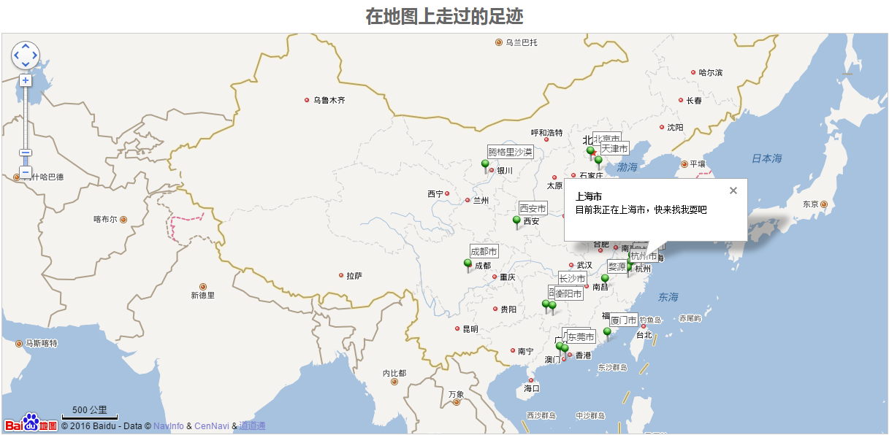

# 在地图上走过的足迹

百度地图API使用

## 使用
+ 注册百度开发者，获得个人密钥，在index.html第22行替换url中ak参数
```
<script src="http://api.map.baidu.com/api?v=2.0&ak=wAXe6n1e7ByUvVvyahsR2dC9d3gwNEaU" type="text/javascript"></script>
```
+ 获取地理位置坐标：[百度地图坐标拾取系统](http://api.map.baidu.com/lbsapi/getpoint/index.html)
+ 填充地图数据：`js/index.js`36行开始，经纬度坐标以“|”分割

[我的足迹](http://duni.sinaapp.com/obj/zuji/)



## 足迹列表

|大致时间 |省      |城市\地区（景点）		|备注 			|
|---------|--------|----------------------------|-----------------------|
|2009-10  |湖南  |长沙（各大高校）		|好友聚会		|
|2011-03  |江苏  |苏州（阳澄湖、拙政园、忠王府、苏州博物馆、山塘街、老苏州城）| 公司年会 |
|2012-春节|浙江  |杭州（杭州市、西湖风景区）|第一次独自旅行（上）|
|2012-春节|浙江  |乌镇（东栅、西栅）	      |第一次独自旅行（下）|
|2013-03  |福建  |厦门（厦门岛、中山路、南普陀寺、厦门大学、白城、环岛南路、胡里山炮台、鼓浪屿）|辞职|
|2013-04/07|广东|广州（海心沙/电视塔、白云山、广州中轴线、西关、上下九、奥林匹克体育中心等）|辞职|
|2013-09/2014-07|天津|五大道、意风区、滨江道、大学城、天塔、古文化街、中心公园|工作出差、外派|
|2014-春节|北京|天安门、故宫、颐和园、圆明园、天坛、八达岭长城|春节回家顺路玩|
|2014-春节|广东|东莞（松山湖、大岭山镇）|东莞过年|
|2014-05|陕西|西安（回民街、大雁塔、西安市区其他）、西岳华山|“On the way”第一次活动|
|2015-春节|湖南|衡阳（南岳衡山）|好友聚会|
|2015-04|内蒙古|阿拉善盟（腾格里沙漠）|公司团建|
|2016-12-31|江苏|无锡军障徒步|乐遇|
